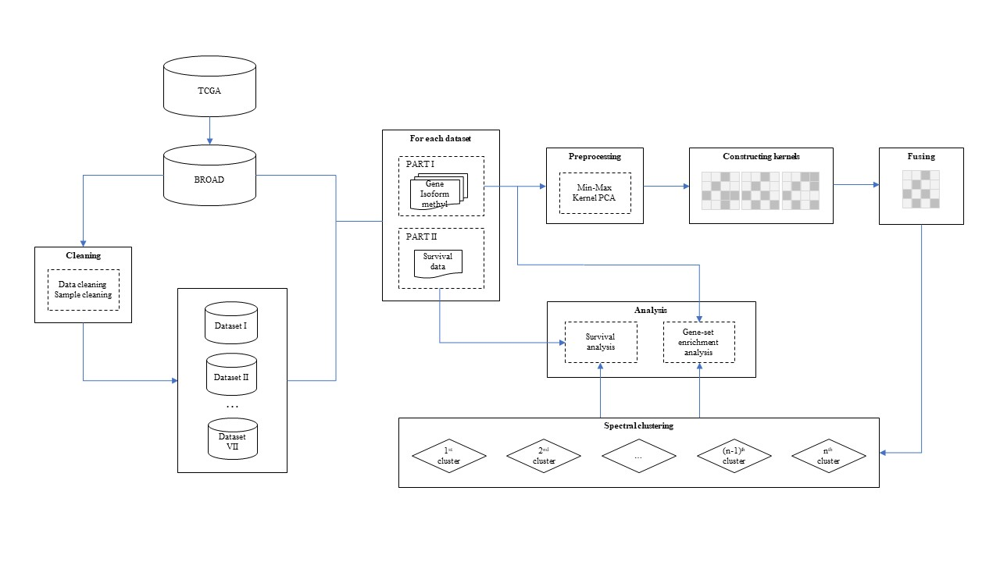

# Clustering-of-cancer-subtypes

We collect seven cancer datasets from the TCGA dataset of the Broad Institute GDAC Firehose, including gene expression profile, isoform expression profile, DNA methylation expression data and survival information correspondingly. Furthermore, we employ kernel PCA to extract features for each expression profile, and convert them into three similarity kernel matrices by Gaussian kernel function, then fuse these matrices as a global kernel matrix. Finally, we apply spectral clustering algorithm on fusion kernel matrix to obtain the clustering on different cancer subtypes.



*The flowchart of our novel method. (a) We first collect and check seven cancer datasets from the TCGA dataset of the Broad Institute GDAC Firehose. (b) For each dataset, after Representing, Constructing, Fusing and Clustering for gene, isoform and DNA methylation data, we carry out survival analysis, gene set enrichment analysis and others.*

## Prerequisites

The following packages are required for executing the main code file: 

* NumPy http://www.numpy.org/
* Pandas https://pandas.pydata.org/
* Scikit-learn http://scikit-learn.org/stable/install.html
* Scikit-survival https://pypi.org/project/scikit-survival/

## Usage

### Data formats

* expression profiles (gene.csv, isoform.csv and methyl.csv): the csv files with **p** rows and **n** columns, where n is the number of samples and p is the number of features.
* survival info. (clinical.csv): a csv file with **n** rows and **p** columns, where n is the number of samples and p is the number of features.

*NOTE: headers and indexes are included in all profiles.*

### Run

The program runs on the dataset (LUNG) while prints logs: 

```python
    [cluster: 2, P - value: 0.92260736]
    [cluster: 3, P - value: 0.08198263]
    [cluster: 4, P - value: 0.00906062]
    [cluster: 5, P - value: 0.05835960]
    [cluster: 6, P - value: 0.05484691]
    [cluster: 7, P - value: 0.16474903]
    [cluster: 8, P - value: 0.32122098]
    [cluster: 9, P - value: 0.16902343]
    [cluster: 10, P - value: 0.18959946]
```
